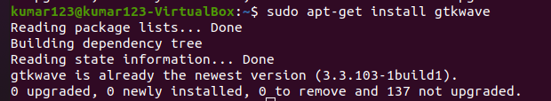

# 4 Week Mini  research internship of VLSI using VSDSquadron Mini RISC-V Development kit
This repositiry is intended to document the learning outcomes and experience of a 4-week workshop on VLSI and RISC-V using VSDSquadron Mini RISC-V Development kit.

Introduction

 
Install required softwares for the program.

 Software and OS needed

 
Ubuntu, Oracle Virtual Machine and packages needed are Yosys,gtkwave,iverilog,OpenSTA,Magic

  
 Yosys 

   

  

